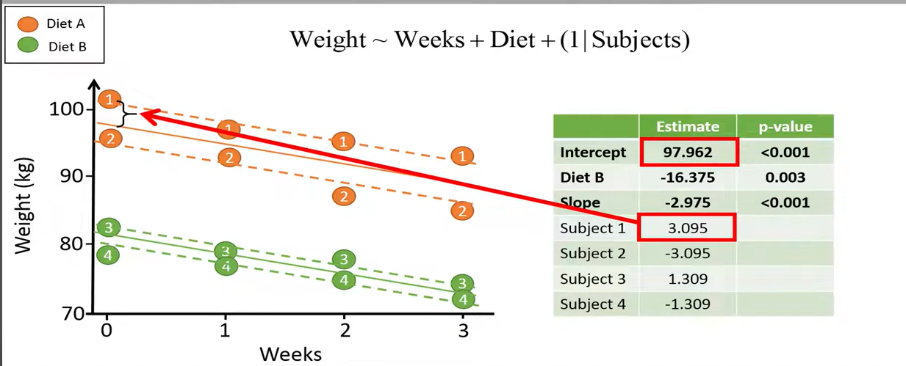

```{r setup, include=FALSE}
knitr::opts_chunk$set(echo = TRUE)
```


THIS A TEST 


## References:

<https://www.youtube.com/watch?v=oI1_SV1Rpfc>

```{r}
library(tidyverse)
```


## Step1 : Create the df

```{r}
df <- data.frame(
  Person = c("Alice", "Bob", "Charlie", "David"),
  Diet = c("A", "A", "B", "B"),
  Before_Diet = c(102, 96, 83, 79),
  After_1_week = c(97, 93, 79, 77),
  After_2_weeks = c(95, 87, 78, 75),
  After_3_weeks = c(93, 85, 74, 72)
)

print(df)
```

## Step2: Plot the data

```{r}

time_mapping <- c("Before_Diet" = "0", "After_1_week" = "1", "After_2_weeks" = "2", "After_3_weeks" = "3")

df_long <- df %>% 
  pivot_longer(cols= Before_Diet:After_3_weeks,
               names_to = "time",
               values_to = "weight") %>% 
  mutate(time_clean_weeks = as.numeric(time_mapping[time]))
```

```{r}

df_long %>% 
  ggplot(aes(x = time_clean_weeks,
             y = weight,
             color = as.factor(Diet)))+
  geom_point()+
  theme_minimal()

```

## Use simple linear regression

```{r}
df_long %>% 
  ungroup() %>% 
  ggplot(aes(x = as.numeric(time_clean_weeks),
             y = weight,
             color = as.factor(Diet)))+
geom_point() +
  geom_smooth(method = "lm", se = FALSE, aes(group = 1), color = "black") +  # General regression
  geom_smooth(method = "lm", se = FALSE, aes(group = Diet))  # Per-group regressions
  
```

Here, the black line is the overall regression (for all individuals). The colored
lines are the per group regressions lines. 

```{r}
overall_regression <- lm(weight ~ time_clean_weeks, data = df_long)
summary(overall_regression)
```
The general intercept is of 89.775 kg (ie the mean weigth for all individuals, at 
week = 0, so before the diet.)

The slope is of -2.975, meaning that the average weight loss is
of approximatively 3kg per week. 

The pvalue of the slope is `0.17`, meaning that the slope is not
different to 0.

This simple linear regression assumes that all data points are independent,
resulting in a high pvalue. 

Because we have repeated measures for a same individual, LMM 
is more appropriate to use. 

## Model with random intercepts
For each individual, we estimate the intercept, assuming that
all individuals have the same slope. 


```{r}
library(lmerTest)

random_intercept_model <- lmer(weight ~ time_clean_weeks+(1|Person),
                               REML = FALSE,
                               data = df_long)

summary(random_intercept_model)

```
`weight ~ time_clean_weeks+(1|Person)` notation means that: 
- `weeks` is the fixed-effect
- `Person` is the random-effect
- the left side of the `|` specifies if we want to use random intercept, slope
or both. A `1` represents that we want to create a model with random
intercept only for the subjects. 

`REML = FALSE` is set so that we can compute the likelihood. 

Here, the ouputs can be interpreted as follow: 
- `89.7750` is the value of the overall intercept
- `-2.9750` is the value of the overall slope

These estimated are the same as the one that were obtained with simple LM.
But now, the pvalue of the slope is < 0.001 (`time_clean_weeks  -2.9750     0.2436 12.0000  -12.21 3.97e-08 ***`).

The random effects (ie the person-wise effect) can be obtained with:

```{r}
ranef(random_intercept_model)
```
The interpretation of this is: 
"Alice as an intercept (ie weight at week 0) `11.391193` kg higher than the overall intercept".
"David as an intercept `9.523784` kg lower that the overall mean." 


We should also allow for a random slope, because we can expect that people
might have different slope (ie different rates at which they lose weight).

To add random slopes, we do:

```{r}
random_slope_model <- lmer(weight ~ time_clean_weeks+(1 + time_clean_weeks |Person),
                               REML = FALSE,
                               data = df_long)

summary(random_slope_model)
```
We add the variable "weeks" because we want for every person, to have their individual 
slopes, associated with the variable "week". 

```{r}
ranef(random_slope_model)
```
Now, for each individual, we have the intercept value, /t to 
the overall intercept, and the slope, compared to the overall slope. 

"Alice has an intercept of 89.775 + 11.910177 kg. Her slope
is of -2.975 + (-0.3533448) = -3.328 kg/week." 

Higher values of random intercept are associated with lower
values of the slopes. The correlation between the random slopes and intercepts
is of `-0.88`, which is logic: individuals with higher initial weight reduce 
their weight faster than people with lower initial weight. 


## Random slope but same intercept
```{r}
random_slope_same_intercept_model <- lmer(weight ~ time_clean_weeks+(0 + time_clean_weeks |Person),
                               REML = FALSE,
                               data = df_long)

summary(random_slope_same_intercept_model)
```

```{r}
ranef(random_slope_same_intercept_model)
```
Using a same intercept is not appropriate here, because persons have a different
weight before the start of the diet.

But, it can be appropriate if we fit the model to weight changes, because 
all four persons will then have a same intercept value of 0.

```{r}
# Calculate the initial weight for each person
df_initial_weight <- df_long %>%
  filter(time_clean_weeks == 0) %>%
  select(Person, initial_weight = weight)

# Join the initial weight back to the original DataFrame
df_long <- df_long %>%
  full_join(df_initial_weight, by = "Person")

# Calculate the weight change compared to the initial weight
df_long <- df_long %>%
  arrange(Person, time_clean_weeks) %>%
  mutate(weight_change = weight - initial_weight)

```

```{r}
df_long %>% 
  ggplot(aes(x = time_clean_weeks, 
             y = weight_change))+
  geom_point()+
  geom_smooth(method = "lm", se = FALSE, aes(group = 1), color = "black") +  # General regression
  geom_smooth(method = "lm", se = FALSE, aes(group = Person, color= Diet))  # Per-group regressions
```

## Include the type of diet

Try a model with random intercepts (`1`)
```{r}
diet_model <- lmer(weight ~ time_clean_weeks+ Diet + (1 |Person),
                               REML = FALSE,
                               data = df_long)

summary(diet_model)
```

The intercept of the fixed part of the model now represents the overall intercept of the 
diet A, which is set as the baseline category. Here, the intercept for the diet
A is of `97.9625` kg. The overall intercept of diet B has an intercept of `-16.3750` kg lower
than the diet B. 

Here, we assume that both diet have the same slope (of `-2.975` kg/week). 

Let's look at the results per individuals:
```{r}
ranef(diet_model)
```
Alice has an intercept about 3kg bigger than the overall intercept of her category (here Diet A.)



The intercept of Charlie is of `97.962 + (-16.375) + (1.309) = 82.896`.

Also, the pvalue of dietB is less that the general 0.05 alpha threshold, which means
that it it significantly different than the intercept of the reference (diet A). In other words,
the persons of diet A have a significantly higher initial weight than people on diet B. 

Now, we want to know if there is a significant difference in the weight loss (slopes) between
the two diets. To do this, we include an interaction term in our model, to allow individuals 
with diet A to have a different slope than the one with diet B. 

```{r}
interaction_model <- lmer(weight ~ time_clean_weeks * Diet + (1 |Person),
                               REML = FALSE,
                               data = df_long)

summary(interaction_model)
```
The diet A is the baseline here, and has a slope of `-3.4` kg/week and an intercept
of `98.6` kg. 
The diet B as an intercept which is `17.65` kg lower than diet B. The slope of the diet B
is `-3.4 + 0.850 = -2.55`. The pvalue of the interaction term is > 0.05, which means that 
the slopes of the two diets are not significantly different to one another. There 
is no significant different difference in weigth loss between the two diets.

## Random intercept and slope

Allow random slopes and random intercept: 

```{r}
random_model <- lmer(weight ~ time_clean_weeks * Diet + (1 |time_clean_weeks |Person),
                               REML = FALSE,
                               data = df_long)

summary(random_model)
```

The `lmer` function will no longer converge because the model is too complex for our 
data set. Should avoid building a model too complicated. 


## Compare two models
It is possible to compare a model with and without interaction, using likelihood comparison ratio. 

```{r}
wo_interaction <- lmer(weight ~ time_clean_weeks+Diet+(1|Person),
                               REML = FALSE,
                               data = df_long)

with_interaction <-  lmer(weight ~ time_clean_weeks*Diet+(1|Person),
                               REML = FALSE,
                               data = df_long)

anova(wo_interaction, with_interaction)
```

Here, the first model is the null model, the simplest model with fewest parameters. 
the logLikelihood is larger for the model with interaction, meaning that it fits better
to the data. But the `0.06092` pvalue shows that it does not significantly fit better 
than the null model. 


## R Markdown

This is an R Markdown document. Markdown is a simple formatting syntax for authoring HTML, PDF, and MS Word documents. For more details on using R Markdown see <http://rmarkdown.rstudio.com>.

When you click the **Knit** button a document will be generated that includes both content as well as the output of any embedded R code chunks within the document. You can embed an R code chunk like this:

```{r cars}
summary(cars)
```

## Including Plots

You can also embed plots, for example:

```{r pressure, echo=FALSE}
plot(pressure)
```

Note that the `echo = FALSE` parameter was added to the code chunk to prevent printing of the R code that generated the plot.
